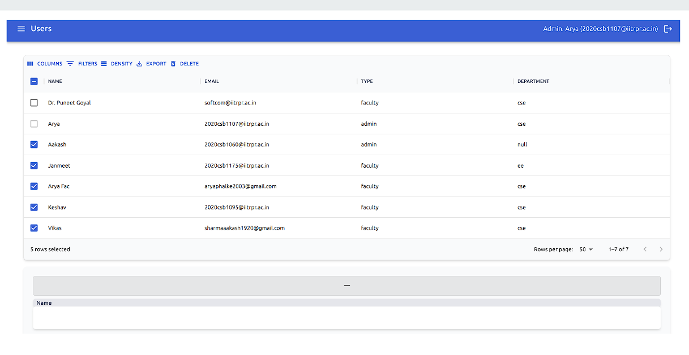

# RnD Grants Management Portal


## Web Portal

<table>
  <tr>
    <td align="center">
      
    </td>
    <td align="center">
      
    </td>
   
  </tr>

  <tr>
    <td align="center">
      Home Page
    </td>
    <td align="center">
      Grant Page
    </td>
    
  </tr>
  
</table>

<table>
  <tr>
    <td align="center">
      
    </td>
      <td align="center">
      
    </td>
  </tr>

  <tr>
     <td align="center">
      User Page
    </td>
     <td align="center">
      Add New Grant
    </td>
  </tr>
  
</table>
<table>
  <tr>
    <td align="center">
      
    </td>
    <td align="center">
      
    </td>
  </tr>
  <tr>
     <td align="center">
      Particular Grant's Page
    </td>
    <td align="center">
      Budget Table
    </td>
  </tr>
</table>


# Instructions to run

This website is built using NodeJS v16.13.2 and npm v8.1.2. These specific versions should be installed.

The deployed website:

https://grants-dep.onrender.com/


To install dependencies:
```
$ npm i
```

To compile (for production):
```
$ npm run build:client
```

To run server:
```
$ npm run start
```

Database developed using PostgreSQL 13.6

To create required database
```
$ createdb grants
$ pg_restore -d grants -O dump.backup
```
Ignore any errors in the second command

Update the required details in `server/.env` & `client/.env`. Specifically, the following fields need to be specified
```
PGHOST=127.0.0.1
PGPASSWORD=
PGDATABASE=grants
PGPORT=5432
GOOGLE_CLIENT_ID=

`PGUSER` is the postgres user to use to login
`PGHOST` is the URL of the database server (127.0.0.1 for local system)
`PGPASSWORD` is the password of the postgres user
`PGDATABASE` is the name of the database to connect to (`grants` if the previous commands were used)
`PGPORT` is the port that the postgres server is listening on (5432 for a default postgres installation)
`GOOGLE_CLIENT_ID` is your client id

```

To restore database on server:
```
$ pg_restore -h dbname.render.com -p 5432 -U dbuser -d grants_xg28 -v dump.backup
```

To deploy on render: Connect git & deploy
